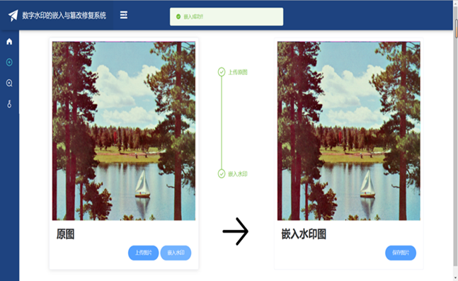

# Authentication-and-tamper-repair-system-of-digital-watermarking-based-on-AMBTC
This is a semi-fragile watermark, embedded in the image, when the image received malicious tampering, the system can detect the tampered position and recover as much as possible.

## System Display

